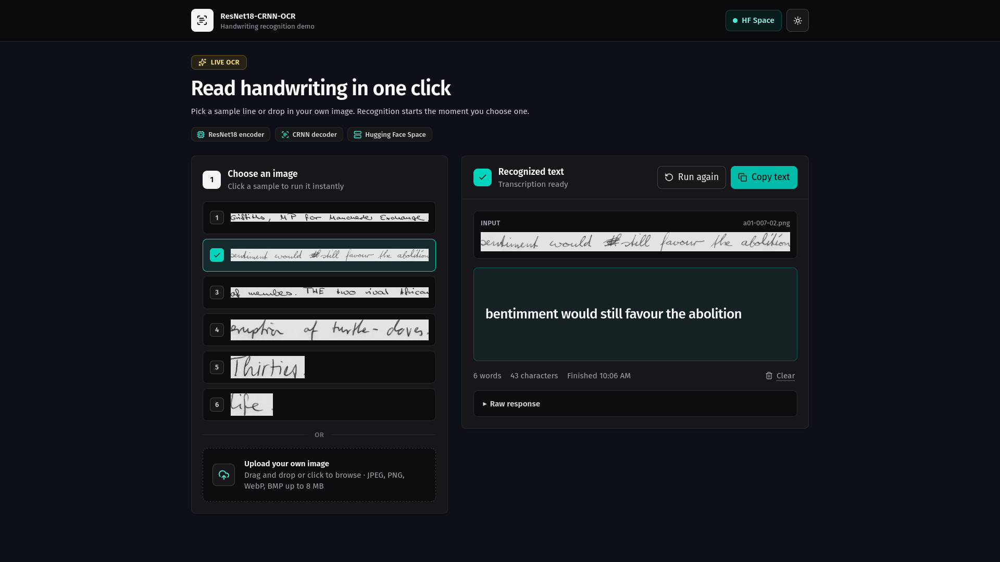
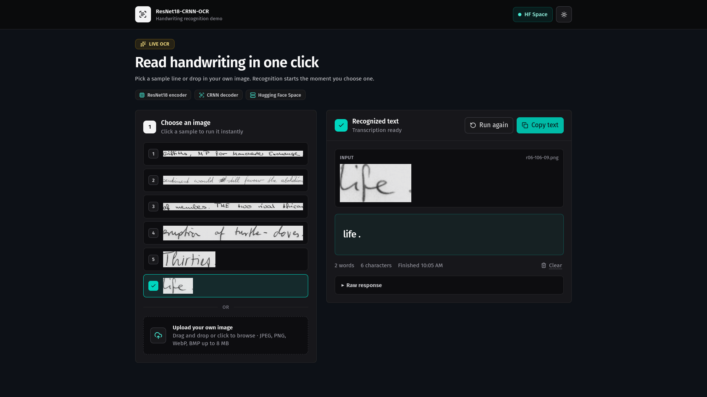
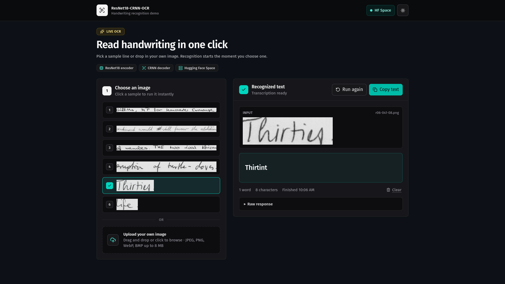

<div align="center">

# ResNet18-CRNN-OCR

**A handwriting recognition demo that turns a scanned line of cursive into machine-readable text the moment you pick an image.**

[](https://resnet18-crnn-ocr.vercel.app/)


[Live Demo](https://resnet18-crnn-ocr.vercel.app/) - [Model](#the-model) - [Features](#features) - [Tech Stack](#technical-stack) - [API](#api-and-backend-specification) - [Run Locally](#installation-and-development)

</div>

## Product Preview

<table>
  <tr>
    <td colspan="2">
      
    </td>
  </tr>
  <tr>
    <td colspan="2" align="center"><strong>Full-line transcription, produced the instant a sample is clicked</strong></td>
  </tr>
  <tr>
    <td width="50%">
      
    </td>
    <td width="50%">
      
    </td>
  </tr>
  <tr>
    <td align="center"><strong>Input preview, counts, and raw payload</strong></td>
    <td align="center"><strong>Raw CTC output — errors shown as-is</strong></td>
  </tr>
</table>

## Overview

ResNet18-CRNN-OCR is a web frontend for a handwritten text recognition model trained on the IAM dataset. Pick one of six bundled handwriting samples or drop in your own scan; the app streams the image to a PyTorch CRNN running on Hugging Face Spaces and renders the decoded line.

The interaction is deliberately button-free: **selecting an image is the submit action**. A run can be stopped mid-flight, re-run, or cleared, and the result panel always shows the exact input crop next to the transcription so a prediction can be judged against what the model actually saw. Nothing is post-processed — the CTC output is displayed verbatim, spelling slips and all.

## The Model

| Resource | Link |
| --- | --- |
| Model weights | [Shad0wKillar/resnet18-crnn-ocr](https://huggingface.co/Shad0wKillar/resnet18-crnn-ocr) |
| Inference Space | [Shad0wKillar/OCR](https://huggingface.co/spaces/Shad0wKillar/OCR) |
| Training data | IAM Handwriting Database (line-level) |

### Architecture

A CNN-RNN hybrid that maps a variable-width image straight to a character sequence:

| Stage | Detail |
| --- | --- |
| Backbone | ResNet18, ImageNet pre-trained. `layer3` / `layer4` strides retuned to `(2, 1)` / `(1, 1)` so horizontal resolution survives downsampling |
| Frozen layers | `conv1`, `bn1`, `layer1`, `layer2` held fixed during training |
| Sequence mapping | `SeqToMap` linear projection collapsing `C x H` into a 256-dim step vector per image column |
| Recurrence | 2-layer bidirectional LSTM, hidden size 256, dropout 0.5 |
| Head | Linear layer over 80 character classes including the CTC blank, then `log_softmax` |
| Decoding | Greedy CTC — argmax per timestep, collapse repeats, drop blanks |
| Input | Fixed height of 96 px, width scaled to preserve aspect ratio |

### Training and Results

Trained for 40 epochs at batch size 128 with Adam (`lr 6e-4`, `CosineAnnealingLR` down to `3e-6`) and `CTCLoss(zero_infinity=True)`, with random affine jitter, brightness/contrast jitter, and probabilistic Gaussian blur standing in for scan-quality variation.

| Metric | Final value |
| --- | --- |
| Train loss | 0.2461 |
| Test loss | 0.4371 |
| Train CER | 6.67% |
| Test CER | 11.48% |

## Features

- **One-click sample gallery**: Six IAM handwriting lines ship with the app; clicking one fetches it, stages it as a `File`, and starts recognition immediately.
- **Drag-and-drop upload**: Bring your own scan — JPEG, PNG, WebP, or BMP up to 8 MB, with rejection messages surfaced inline.
- **Zero-step submission**: Choosing an image *is* the run. No separate submit button to hunt for.
- **Cancellable, re-runnable inference**: Every request is `AbortController`-backed, so a run can be stopped and restarted without stale responses landing in the UI.
- **Cold-start aware**: The Space idles on free CPU hardware. After 5 seconds the panel explains that the container is waking rather than leaving the user guessing.
- **Input shown beside output**: The exact crop sent to the model renders next to its transcription, plus word count, character count, and finish time.
- **Raw payload inspector**: A collapsible panel exposes the untouched JSON response for debugging.
- **Resilient response parsing**: The client walks the payload for a text field across a range of common key names, so a backend shape change degrades instead of breaking.
- **Light and dark themes**: Preference is persisted to `localStorage` and applied pre-hydration via a blocking script, so there is no flash of the wrong theme.

## Technical Stack

| Layer | Technology |
| --- | --- |
| Framework | Next.js 16 App Router (React Compiler enabled) |
| UI Library | React 19 |
| Language | TypeScript 5 |
| Styling | Tailwind CSS v4 |
| Motion | Framer Motion |
| Components | Radix UI, shadcn, Lucide React, react-dropzone |
| Package Manager | pnpm |
| Inference Backend | ResNet18-CRNN (PyTorch + FastAPI) on Hugging Face Spaces |

## How a Request Flows

```text
Sample click / file drop
  → useOcrPrediction stages the File and aborts any in-flight run
  → POST /api/predict            (multipart, field name "file")
  → Next.js route handler (Node runtime, 60s cap)
      · resolves the Space hostname, preferring a public IPv4 address
      · keeps Host and TLS SNI pinned to the original hostname
      · hand-builds the multipart body and streams it upstream
  → https://shad0wkillar-ocr.hf.space/predict
      · resize to 96px height, ImageNet normalize
      · ResNet18 → SeqToMap → BiLSTM → CTC greedy decode
  → { "text": "..." } forwarded back with the upstream status
  → extractOcrText normalizes the payload and the panel renders it
```

The browser never talks to Hugging Face directly — the route handler is the only egress point, which keeps the endpoint swappable through a single environment variable.

## Directory Structure

```text
src/app/page.tsx
  Main screen: hero, two-column layout, and mobile scroll-to-result behavior.

src/app/layout.tsx
  Metadata and the pre-hydration theme script.

src/app/api/predict/route.ts
  Server-side proxy to the Hugging Face Space: multipart assembly,
  public-IP resolution, 60-second timeout, and upstream error passthrough.

src/hooks/use-ocr-prediction.ts
  Run lifecycle — staging, aborting, re-running, and status derivation.

src/hooks/use-object-url.ts
  Object URL for the staged file, revoked on change.

src/components/sample-gallery.tsx
  Bundled IAM samples, fetched and converted to File objects on click.

src/components/image-dropzone.tsx
  Drag-and-drop upload with type and size validation.

src/components/ocr-result-panel.tsx
  Idle / running / ready / done / error states, elapsed timer, copy button,
  and the raw response inspector.

src/lib/ocr.ts
  Payload normalization: text extraction, formatting, and error messages.

src/lib/samples.ts
  Sample manifest and loader.

public/samples/*.png
  The six bundled handwriting samples.

assets_github/*.png
  README screenshots.
```

## Installation and Development

### Prerequisites

- Node.js
- pnpm

### Run Locally

```bash
pnpm install
pnpm dev
```

Open `http://localhost:3000` in your browser.

### Point at a Different Backend

The endpoint is read once at module load and falls back to the public Space:

```bash
HF_OCR_ENDPOINT="https://your-space.hf.space/predict" pnpm dev
```

Any backend accepting a `file` multipart field and returning text in the JSON body will work.

### Production Build

```bash
pnpm build
pnpm start
```

## API and Backend Specification

The route handler forwards multipart form data to the deployed model endpoint.

| Field | Value |
| --- | --- |
| URL | `https://shad0wkillar-ocr.hf.space/predict` |
| Method | `POST` |
| File field | `file` |
| Accepted types | JPEG, PNG, WebP, BMP (max 8 MB client-side) |
| Timeout | 60 seconds |

### Request Payload

```ts
const formData = new FormData();
formData.append("file", imageFile);
```

### Response Payload

```json
{
  "text": "bentimment would still favour the abolition"
}
```

The client also tolerates alternative shapes — `prediction`, `predicted_text`, `transcription`, `result`, string arrays, and nested objects are all searched before falling back to pretty-printed JSON.

## License

This project is released under the license included in [LICENSE](./LICENSE).
